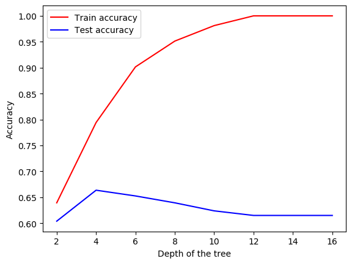

# Decision Tree

Credits: http://archive.ics.uci.edu/ml/datasets/Arrhythmia  

The code takes file path to run decision tree on from command line and trains and tests the accuracy of the tree created and creates a plot of the accuracy  
The reason the validation curve comes down after reaching a peak is because of overfitting on training data by the model

### Graph generated for arrhythmia dataset
